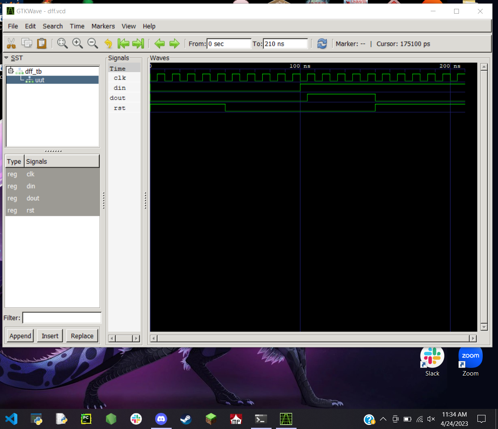
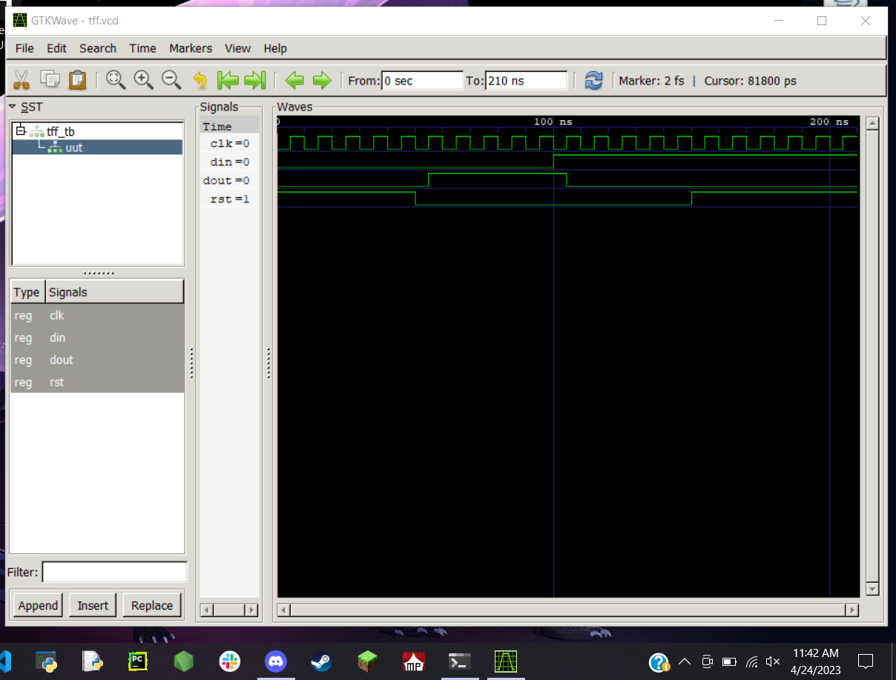
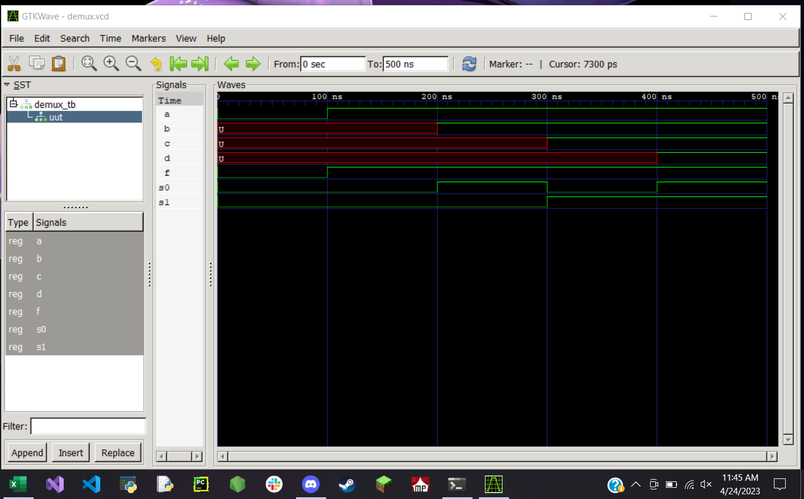
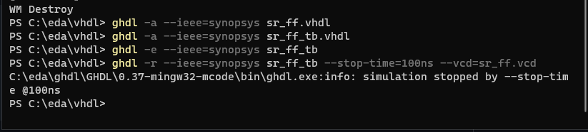
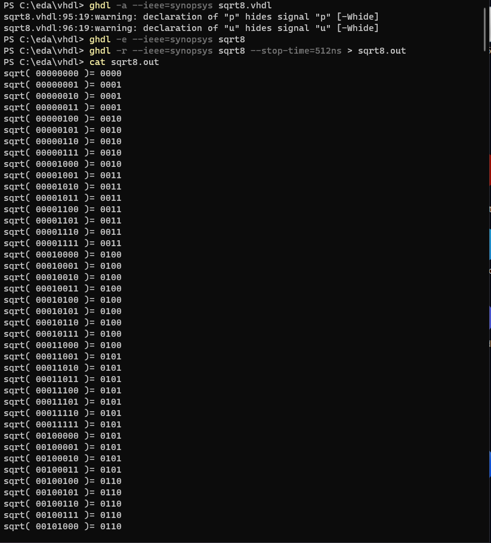
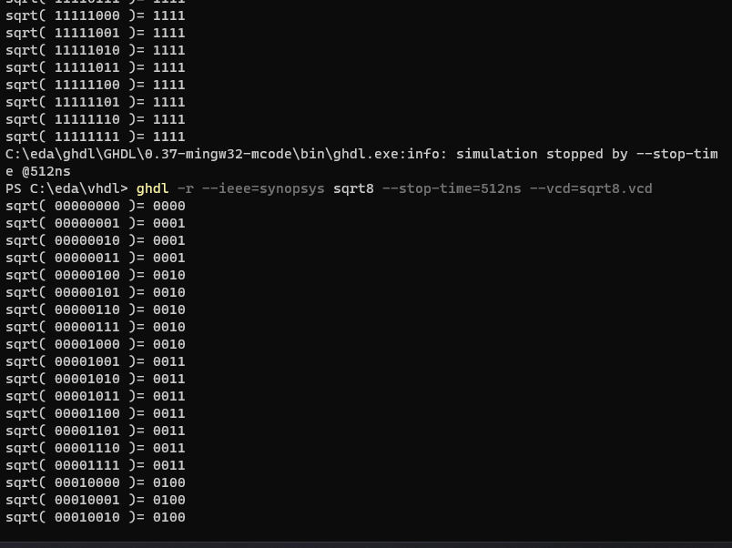
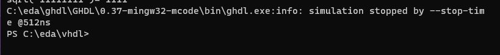

# Design-6
## Repo for D6
### 

# Labs:
## Lab 1
 * Half-Adder

 * D Flip-Flop

 * T Flip-Flop

 * 4-1 Multiplexer

 * 1-4 Demultiplexer

 * SR Flip-Flop

 * 8-Bit Square Root
  * Not all square roots are listed here, just a few examples to show it works

